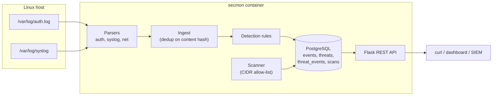

# secmon — Security Monitoring & Threat Detection System

[](https://github.com/Infix8/Security-Monitoring-Threat-Detection-System/actions/workflows/ci.yml)
[](https://www.python.org/downloads/release/python-3120/)
[](https://docs.docker.com/compose/)
[](https://www.postgresql.org/)

A Python service that ingests Linux authentication and network activity logs,
runs detection rules over them, persists findings to PostgreSQL, and exposes
everything through a REST API. Fully containerized; runs identically on a
laptop or an EC2 instance.

---

## What it does

- Parses OpenSSH `auth.log` lines into structured events
- Applies detection rules for **brute force**, **port scanning**, and
  **suspicious connection** patterns
- Scans authorized hosts for open ports (CIDR allow-listed)
- Stores events, threats, and scans in PostgreSQL with content-hash dedup
- Serves it all over a small Flask REST API
- Ships as two containers: one stateless app, one Postgres with a named volume

---

## Architecture



---

## Try it in 30 seconds

```bash
git clone https://github.com/Infix8/Security-Monitoring-Threat-Detection-System.git
cd Security-Monitoring-Threat-Detection-System
cp .env.example .env                 # dev defaults are fine
docker compose up -d --build         # db + api, healthchecked
curl -s localhost:8000/healthz       # {"db":true,"status":"ok"}
```

Ingest the bundled sample log and see a threat appear:

```bash
docker compose exec -T api python - <<'PY'
import sys; sys.path.insert(0, "/app")
from app.ingest import ingest_auth_file
for k, v in ingest_auth_file("/app/sample_logs/auth.log").items():
    print(f"  {k:<20} {v}")
PY

curl -s localhost:8000/api/threats | python -m json.tool
curl -s localhost:8000/api/summary | python -m json.tool
```

Expected summary after ingesting the sample:

```json
{
  "events":  {"total": 14, "by_severity": {"info": 6, "notice": 1, "warning": 7}},
  "threats": {"total": 1,  "by_rule":      {"brute_force": 1}},
  "top_source_ips": [{"source_ip": "203.0.113.42", "threats": 1}]
}
```

---

## Detection rules

| Rule | Fires when | Severity | MITRE |
|---|---|---|---|
| `brute_force` | >= `FAILED_LOGIN_THRESHOLD` failed auth events from one IP inside `FAILED_LOGIN_WINDOW_SEC` | `warning`, escalates to `critical` at 2x threshold | T1110 |
| `port_scan` | One source hits >= `PORTSCAN_DISTINCT_PORTS` distinct destination ports inside `PORTSCAN_WINDOW_SEC` | `warning` | T1046 |
| `suspicious_connection` | Invalid-user burst (>=2) or preauth disconnect burst (>=3) from one IP | `notice` / `warning` | T1110.001 |

Design: **one finding per burst, anchored on the first event** — not a rolling
window. This avoids the classic "alert storm" problem (one attack producing N
alerts as the window slides).

---

## REST API (excerpt)

| Method | Path | Notes |
|---|---|---|
| GET  | `/healthz`          | Liveness + DB ping |
| GET  | `/api/events`       | `?limit=&severity=&source_ip=&event_type=&since=` |
| GET  | `/api/events/<id>`  | Single event |
| GET  | `/api/threats`      | `?limit=&rule=&severity=&since=` |
| GET  | `/api/threats/<id>` | Threat + `linked_event_ids` |
| GET  | `/api/summary`      | Counts by severity/rule, top source IPs |
| GET  | `/api/scans`        | Recent scans |
| GET  | `/api/scans/<id>`   | Single scan |
| POST | `/api/scans`        | `{"target":"127.0.0.1","ports":[...],"banners":true}` |

`since` accepts ISO-8601 or short forms like `30m`, `24h`, `7d`.

---

## Layout

```
app/
  config.py         settings loaded from env
  db.py             engine, session_scope, Base
  models.py         events, threats, threat_events, scans
  ingest.py         parse -> persist events -> detect -> persist threats
  parsers/
    base.py         ParsedEvent dataclass
    auth.py         SSH auth.log parser
  detection/
    base.py         Finding dataclass
    rules.py        brute_force, port_scan, suspicious_connection
  scanner/
    portscan.py     allow-listed TCP connect scanner
    store.py        persist scan results
  api/
    app.py          Flask factory
    routes.py       /events, /threats, /summary, /scans
alembic/            migrations
docker/entrypoint.sh  waits for DB, migrates, execs gunicorn
scripts/            dev + deploy helpers
sample_logs/        fixtures for tests and demos
tests/              pytest suite
docs/               security notes
```

---

## Design decisions (the interesting parts)

**Dedup by content hash, not by row id.** Each parsed event hashes
`sha256(raw|ts|event_type)`. Re-ingesting the same file inserts zero rows and
the second ingest is provably idempotent. Threats dedup on
`rule|source_ip|window_start|window_end` — the *attack campaign* is the
identity, not the row.

**Burst detection, not sliding windows.** A rule's window anchors on the first
event and grows while the next event is within `window_sec` of *that anchor*.
Once the burst closes, it emits exactly one finding. This is why `port_scan`
fires once for a 20-port scan instead of 6 times as a rolling window would.

**Pure-function rules.** Detection is `list[ParsedEvent] -> list[Finding]`.
No DB, no I/O, no side effects. That's why the full test suite runs in
under 0.05s and why adding a new rule never touches the ingest pipeline.

**Migrations on boot, not on deploy.** The container entrypoint waits for
Postgres, runs `alembic upgrade head`, then execs gunicorn. Same code path
locally and on EC2.

---

## Safety

`app/scanner/portscan.py` refuses any target outside `SCAN_ALLOWED_CIDRS`
(default: `127.0.0.1/32,10.0.0.0/8,192.168.0.0/16`). Only scan systems you own
or have written authorization to test. A `POST /api/scans` to a public IP
returns HTTP 403.

---

## Local dev (host-side, DB in Docker)

```bash
python3 -m venv .venv && source .venv/bin/activate
pip install -r requirements.txt
docker compose up -d db
alembic upgrade head
python scripts/ingest_sample.py
bash scripts/run_api.sh
# -> http://localhost:8000/healthz
```

## Full stack in Docker

```bash
docker compose up -d --build
curl -s localhost:8000/api/summary | python -m json.tool
```

## Tests

```bash
pytest -q
# 22 passed
```

## Deploy to EC2

```bash
git clone https://github.com/Infix8/Security-Monitoring-Threat-Detection-System.git secmon
cd secmon
cp .env.example .env && $EDITOR .env   # set real secrets
sudo bash scripts/deploy_ec2.sh
# open 8000/tcp in the EC2 Security Group
```

## See also

- [docs/security-notes.md](docs/security-notes.md) — common web vulnerabilities + remediation
